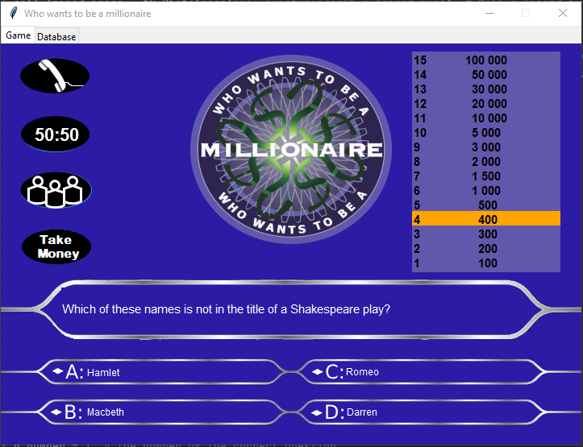
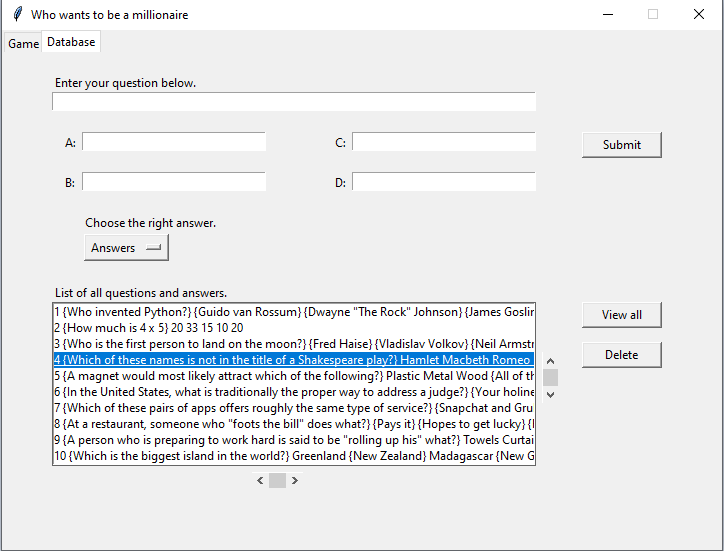

# WhoWantsToBeAMillionaire
🕹 The Quiz game that all of you must be familiar with 🕹

You have to answer 15 questions right to win the big prize of $100 000.

The application has been created using the GUI library Tkinter and SQLite. It consists of two tabs. The main tab("Game") is with the game itself and the second tab("Database") provides the user with multiple functionalities to customize the question base.

# Functionalities

### The "Game" tab:
    o Three lifelines - 50:50, Phone a Friend, Ask the Audience.
    o Opportunity to give up and walk away with your current prize.
    o Labels with all of the prizes and the one that you are currently on.
    o Question label and answers buttons.

### The "Database" tab:
    o View the list of questions and their answers.
    o Addition/Removal of custom questions and answers.
    
## Preview:

### "Game" tab:

    

### "Database" tab:

    

